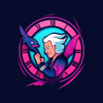

<div id="top"></div>

[![Contributors][contributors-shield]][contributors-url]
[![Forks][forks-shield]][forks-url]
[![Stargazers][stars-shield]][stars-url]
[![Issues][issues-shield]][issues-url]
[![MIT License][license-shield]][license-url]

<!-- PROJECT LOGO -->
<br />
<div align="center">
  <a href="https://github.com/Ntropy86/CF">
    
  </a>

<h3 align="center">CF CalCode</h3>

  <p align="center">
    Making Sure you conquer the world. One Test Case at a Time xD
    <br />
    <a href="https://github.com/Ntropy86/GymHelpr"><strong>Explore the docs »</strong></a>
    <br />
    <br />
    <a href="https://github.com/Ntropy86/GymHelpr">View Demo</a>
    ·
    <a href="https://github.com/Ntropy86/GymHelpr/issues">Report Bug</a>
    ·
    <a href="https://github.com/Ntropy86/GymHelpr/issues">Request Feature</a>
  </p>
</div>

<!-- TABLE OF CONTENTS -->
<details>
  <summary>Table of Contents</summary>
  <ol>
    <li>
      <a href="#about-the-project">About The Project</a>
      <ul>
        <li><a href="#built-with">Built With</a></li>
      </ul>
    </li>
    <li>
      <a href="#getting-started">Getting Started</a>
      <ul>
        <li><a href="#prerequisites">Prerequisites</a></li>
        <li><a href="#installation">Installation</a></li>
      </ul>
    </li>
    <li><a href="#usage">Usage</a></li>
    <li><a href="#roadmap">Roadmap</a></li>
    <li><a href="#contributing">Contributing</a></li>
    <li><a href="#license">License</a></li>
    <li><a href="#contact">Contact</a></li>
    <li><a href="#acknowledgments">Acknowledgments</a></li>
  </ol>
</details>

<!-- ABOUT THE PROJECT -->

## About The Project

[![Product Name Screen Shot][product-screenshot]](https://example.com)

# Codeforces Calendar

This project aims to create a calendar for Codeforces contests. It fetches contest data from the Codeforces API and displays it in a calendar format.

<p align="right">(<a href="#top">back to top</a>)</p>

### Built With

<!--
-   [Next.js](https://nextjs.org/)
-   [React.js](https://reactjs.org/)
-   [Vue.js](https://vuejs.org/)
-   [Angular](https://angular.io/)
-   [Svelte](https://svelte.dev/)
-   [Laravel](https://laravel.com)
-   [Bootstrap](https://getbootstrap.com)
-   [JQuery](https://jquery.com) -->

<p align="right">(<a href="#top">back to top</a>)</p>

<!-- GETTING STARTED -->

## Getting Started

Please read the instructions Given below Carefully 

### Prerequisites

- Make sure you are using a Browser running Chromium V108 and above

### Installation
0. Fork The Repo
1. Clone the Forked repo
    ```sh
    git clone https://github.com/<YourGitHubUsername>/CF.git
    ```
2. Install The Extension From Extension Settings
  - Open up your Chromium Based Browser and Click on Load Unpacked Extension
  - Select the Folder With all the contents of the Repo
  - Voila! You have Installed the Extension.

3. Contributing
  - In order to contribute Feel free to Raise a PR With a Suitable Title and Description of What You appended.
  - Please make sure that your changes do not break any of the existing Functionalities or break the extension altogether. 

## Setup Instructions

1. Clone the repository:
    ```sh
    git clone https://github.com/yourusername/Codeforces-Calendar.git
    cd Codeforces-Calendar
    ```

2. Install dependencies:
    ```sh
    npm install
    ```

3. Run the application:
    ```sh
    npm start
    ```

4. Open your browser and navigate to `http://localhost:3000` to view the calendar.

<p align="right">(<a href="#top">back to top</a>)</p>

<!-- USAGE EXAMPLES -->

## Usage

_For more examples, please refer to the [Documentation](https://example.com)_

<p align="right">(<a href="#top">back to top</a>)</p>

<!-- ROADMAP -->

## Roadmap

-   [ ] Feature 1
-   [ ] Feature 2
-   [ ] Feature 3
    -   [ ] Nested Feature

See the [open issues](https://github.com/Ntropy86/GymHelpr/issues) for a full list of proposed features (and known issues).

<p align="right">(<a href="#top">back to top</a>)</p>

<!-- CONTRIBUTING -->

## Contributing

Contributions are what make the open source community such an amazing place to learn, inspire, and create. Any contributions you make are **greatly appreciated**.

If you have a suggestion that would make this better, please fork the repo and create a pull request. You can also simply open an issue with the tag "enhancement".
Don't forget to give the project a star! Thanks again!

1. Fork the Project
2. Create your Feature Branch (`git checkout -b feature/AmazingFeature`)
3. Commit your Changes (`git commit -m 'Add some AmazingFeature'`)
4. Push to the Branch (`git push origin feature/AmazingFeature`)
5. Open a Pull Request

<p align="right">(<a href="#top">back to top</a>)</p>

<!-- LICENSE -->

## License

Distributed under the MIT License. See `LICENSE.txt` for more information.

<p align="right">(<a href="#top">back to top</a>)</p>

<!-- CONTACT -->

## Contact

Nitigya Kargeti - [@Ntropy86](https://twitter.com/Ntropy86) 


Anant Kumar Srivastava - [@the-anantkumar](https://www.linkedin.com/in/anant-kumar-srivastava-65223a5b/)


Project Link: [CalCode](https://github.com/Ntropy86/CF)

<p align="right">(<a href="#top">back to top</a>)</p>

<!-- ACKNOWLEDGMENTS -->

## Acknowledgments

-   [Ntropy](https://github.com/Ntropy86)


-   [the_anantkumar](https://github.com/the-anantkumar)

<p align="right">(<a href="#top">back to top</a>)</p>

<!-- MARKDOWN LINKS & IMAGES -->
<!-- https://www.markdownguide.org/basic-syntax/#reference-style-links -->

[contributors-shield]: https://img.shields.io/github/contributors/Ntropy86/CF.svg?style=for-the-badge
[contributors-url]: https://github.com/Ntropy86/CF/graphs/contributors
[forks-shield]: https://img.shields.io/github/forks/Ntropy86/CF.svg?style=for-the-badge
[forks-url]: https://github.com/Ntropy86/CF/network/members
[stars-shield]: https://img.shields.io/github/stars/Ntropy86/CF.svg?style=for-the-badge
[stars-url]: https://github.com/Ntropy86/CF/stargazers
[issues-shield]: https://img.shields.io/github/issues/Ntropy86/CF.svg?style=for-the-badge
[issues-url]: https://github.com/Ntropy86/CF/issues
[license-shield]: https://img.shields.io/github/license/Ntropy86/CF.svg?style=for-the-badge
[license-url]: https://github.com/Ntropy86/CF/blob/master/LICENSE.txt
[linkedin-shield]: https://img.shields.io/badge/-LinkedIn-black.svg?style=for-the-badge&logo=linkedin&colorB=555
[linkedin-url]: https://linkedin.com/in/nitigyak
[product-screenshot]: images/screenshot.png
